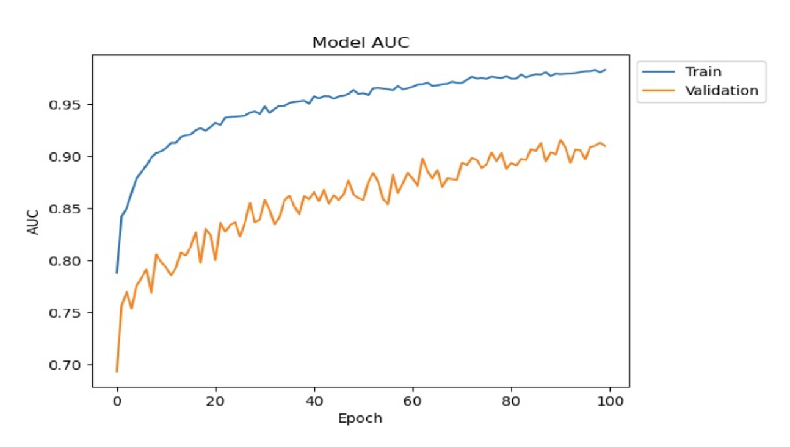
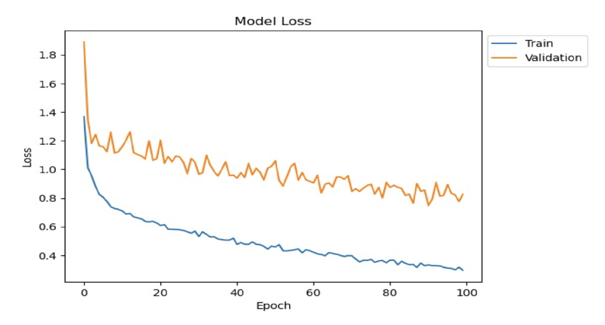
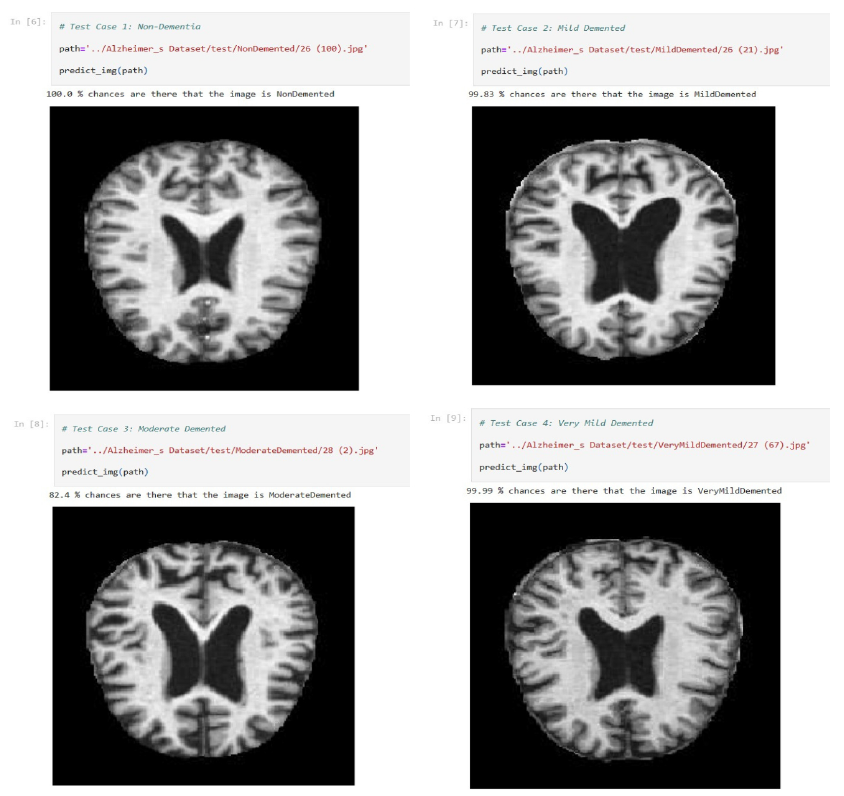

# Alzheimers_Classifier
This is a CNN model to classify Alzheimer's disease in a patient using DenseNet-169 pre-trained keras weights and transfer learning technique.

DenseNet architecture explicitly differentiates between information that is added to the network and information that is preserved. DenseNet layers are very narrow (e.g., 12 filters per layer), adding only a small set of feature maps to the “collective knowledge” of the network and keeping the remaining feature maps unchanged—and the final classifier makes a decision based on all feature maps in the network. Besides better parameter efficiency, one significant advantage of DenseNets is their improved flow of information and gradients throughout the network, which makes them easy to train. Each layer has direct access to the gradients from the loss function and the original input signal, leading to implicit deep supervision. This helps in the training of deeper network architectures. Further, we also observe that dense connections have a regularizing effect, which reduces overfitting on tasks with smaller training set size.

Instead of drawing representational power from extremely deep or wide architectures, DenseNets exploit the network's potential through feature reuse, yielding condensed models that are easy to train and highly parameter efficient. Concatenating feature maps learned by different layers increases variation in the input of subsequent layers and improves efficiency. This constitutes a significant difference between DenseNets and ResNets. Compared to Inception networks, which also concatenate features from different layers, DenseNets are simpler and more efficient.

## Graphs for Model Accuracy and Model Loss are shown below:

  
  

  
  

  
  

  
## The output obtained is as follows:

  
  

